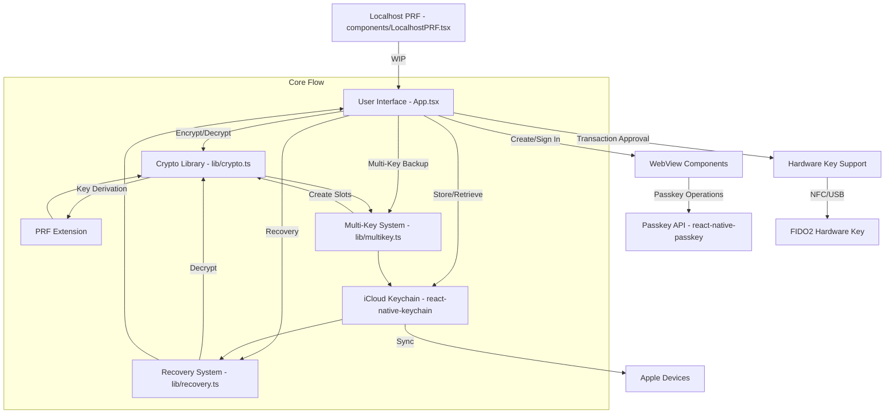

+++
title = "Nuri Wallet iOS Expo App Mermaid Chart of the Architecture"
date = 2025-08-28T08:30:02Z
draft = false
author = "Emino"
tags = ["email-post", "photos"]
categories = ["blog"]
image = "/media/nuri-wallet-ios-expo-app-mermaid-chart-of-the-architecture/mermaid-chart-nuri-passkey-security.png"
+++

Based on my analysis of the codebase, including the README.md and the main
App.tsx file, I'll first provide a detailed explanation of the codebase.
Then, I'll include a Mermaid chart representing the application
architecture.

### Codebase Explanation

This is a React Native Expo application called "Nuri" focused on
passkey-based Bitcoin seed encryption. It uses WebAuthn passkeys with the
PRF (Pseudo-Random Function) extension to securely encrypt Bitcoin seeds,
store them in iCloud Keychain, and enable recovery across multiple
passkeys. The app is designed for iOS 16+ devices with biometric
authentication (Face ID/Touch ID) and iCloud Keychain enabled.

#### Key Features
- **Passkey Creation and Authentication**: Users create and sign in with
passkeys to derive encryption keys via PRF.
- **Seed Encryption**: Encrypts Bitcoin seeds using XChaCha20-Poly1305 with
keys derived from PRF.
- **Multi-Key Backup**: Supports backups decryptable by multiple passkeys
(version 3 format).
- **iCloud Sync**: Stores encrypted backups in iCloud Keychain with
per-user namespaces.
- **Hardware Security Key Support**: For transaction approval (e.g.,
YubiKey), though PRF is limited on iOS for hardware keys.
- **Recovery**: Allows decryption using any associated passkey or guardian
DEKs.

#### Project Structure
The codebase is organized as follows (based on the file listing and README):
- **Root Files**: Configuration and entry points like `App.tsx` (main UI
and logic), `index.js` (React Native entry), `package.json`,
`tsconfig.json`, etc.
- **lib/**: Core utilities.
  - `crypto.ts`: Handles key derivation (HKDF-SHA256), encryption
(XChaCha20-Poly1305), PRF normalization.
  - `multikey.ts`: Manages multi-key backups with key slots for multiple
passkeys.
  - `recovery.ts`: Functions for detecting backup versions and recovering
seeds.
  - `inAppLocalhostServer.ts`: Likely for in-app server (WIP).
- **components/**: Reusable components.
  - `LocalhostPRF.tsx`: Component for localhost PRF server (work in
progress).
- **WebView Components**:
  - `EmbeddedPRF.tsx`: For domain-bound passkey authentication.
  - `CreatePasskeyWebView.tsx`: For creating new passkeys.
- **docs/**: Extensive documentation and server examples (HTML files for
testing PRF, PWA, etc.).
- **scripts/**: e.g., `guardian-server.mjs` for guardian features.
- **assets/**: App icons and splash screens.

#### Main Logic (from App.tsx)
The app's core is in `App.tsx`, which manages the UI and wallet state. It
includes:
- State management for PRF, DEK (Data Encryption Key), guardians, hardware
keys, and backups.
- UI with steps for: creating passkeys, signing in, encrypting seeds,
storing in iCloud, adding recovery keys, and recovering seeds.
- Integration with WebViews for passkey operations (domain-bound to `
passkey.nuri.com`).
- Hardware key support for transaction approval (using NFC/USB keys).
- Recovery flow that handles single-key (v1) and multi-key (v3) backups,
prompting users to select keys.

#### Security and Limitations
- Encryption uses a master key encrypted in slots for each passkey.
- Backups are stored per-user in iCloud Keychain with unique services
(e.g., `com.nuri.seed.backup.Alice`).
- Limitations: PRF is device-specific; cross-device recovery requires
manual DEK sharing; iOS restricts PRF on hardware keys.

#### Dependencies
- `react-native-passkey`: For WebAuthn.
- `react-native-keychain`: iCloud integration.
- `@noble/hashes`: Crypto primitives.
- Others like `expo-random`, `react-native-webview`.

The codebase is a proof-of-concept with some WIP features (e.g., localhost
PRF, guardian recovery). It's MIT-licensed and emphasizes security warnings.

### Mermaid Chart of the Architecture
Below is a Mermaid flowchart representing the high-level architecture and
flow. It shows the main components and how they interact in the
encryption/recovery process.

This chart illustrates:
- User interactions starting from the main app.
- Flows for passkey handling, encryption, backup, and recovery.
- Connections to external systems like hardware keys and iCloud.

If this explanation and chart meet your needs, please toggle to Act mode if
you want me to implement changes or create files based on this. Otherwise,
let me know if you'd like more details on specific parts.

---
*This post was created via email by emin@nuri.com*
